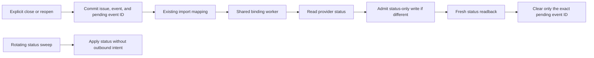

# Two-way issue status sync for Notion, GitHub, and Plane

**Status: implemented.** This document defines the status-sync contract and its
four-column storage.

## Outcome and scope

Closing or reopening an imported issue in Kata updates the corresponding
Notion task, GitHub issue, or Plane work item. Status changes made upstream continue to arrive
in Kata. All three providers use the same delivery and recovery rules.

The requested scope is open/closed status. Existing incoming imports remain;
outbound title, body, assignment, labels, comments, dates, relationships, and
issue creation are excluded. Kata gains no in-progress state. GitHub Projects
board fields and Notion task-database/schema creation are excluded.

Notion's existing workflow groups define completion. Operators should not have
to enumerate their custom completed options again in Kata. Ordinary setup
should require only the existing source selection and an explicit two-way opt-in.

This spec assumes local reopen should also propagate upstream, writes should
survive outages, and accepted local changes should remain responsive. The user
selected the first option in Complete as the default close target, with an
optional override. The proposed reopen default applies the same rule to To-do.
These are product choices, not additional Notion API facts.

## Evidence and the simpler Notion integration

Official documentation was checked on 2026-09-29. The initial repository audit used Notion PR #454 at
`e4b8c8bc542a9fde34a57901d5134f25e9f97990`; implementation builds on that
one-way integration.

Notion lets users designate status, assignee, and due-date properties when
turning a database into Tasks. Its Status property organizes custom options
under To-do, In progress, and Complete. These are separate from the customizable
option names. [Task database setup](https://www.notion.com/help/sprints),
[workflow categories](https://www.notion.com/help/guides/status-property-gives-clarity-on-tasks).

The API returns `status.options` and `status.groups`. Groups contain an ID,
name, color, and an ordered `option_ids` list. Therefore Kata can classify a
task by its option's membership in the selected Complete group. Group IDs are
data-source-specific; there is no documented universal group-role ID or role
enum on the response. Bootstrap uses the documented group names, with explicit
selection available when those names do not identify the intended groups.
[Status schema](https://developers.notion.com/reference/property-object#status),
[group configuration](https://developers.notion.com/reference/update-data-source-properties#status-configuration-updates).

Database and data-source objects expose `database_type`, including task
databases. Their documented fields do not identify which property was chosen
as task status in the setup UI. This is an inference from the published schemas:
Kata should discover the sole property of type `status`, or use its existing
explicit selector when several exist. A `database_type` value alone does not
resolve that ambiguity. Regular databases with the same Status schema work too.
[Database object](https://developers.notion.com/reference/database),
[data-source object](https://developers.notion.com/reference/data-source).

Notion accepts an existing status option by ID through a page update. It does
not accept "mark this group complete" as a page value. A successful write can
change only the selected Status property, leaving other properties untouched.
Update-content capability is required. The documented endpoint has no
conditional revision precondition. [Page status values](https://developers.notion.com/reference/page-property-values#status),
[page updates](https://developers.notion.com/reference/patch-page).

GitHub supports `PATCH /repos/{owner}/{repo}/issues/{number}` with `state` set
to `open` or `closed`. The credential needs Issues write permission.
[Issue updates](https://docs.github.com/en/rest/issues/issues#update-an-issue).

The one-way Notion integration already provides shared orchestration in
`internal/issuesync`. Both store importers gate scalar updates on the whole
issue's `UpdatedAt`; that gate cannot also decide status authority. Existing
import mappings already provide source, object, project, and issue identity,
and close/reopen events already provide attributed durable intent.

Notion content import already reads `GET /v1/pages/{page_id}/markdown` directly;
it does not fetch or convert block JSON. Preserve the returned enhanced
Markdown and existing source attribution. Notion-specific tags may remain in
the body, unsupported content may appear as placeholders, and media URLs may
expire. Status-only reads and writes need no Markdown. The owning
[Notion sync guide](../operations/notion-sync.md) describes the content limits.

## Plane workflow integration

Plane extends the same worker using the project mirror from PR #457. Its live
workflow state UUIDs are classified by group: `completed` and `cancelled` mean
closed; `backlog`, `unstarted`, `started`, and `triage` mean open. Incoming
completion uses reason `done` and cancellation uses `wontfix`. Preserve native
closure evidence when the binary state already matches.

Close selects the first live `completed` state in ascending workflow `sequence`;
reopen selects the first `unstarted` state. UUID order breaks sequence ties.
Optional `closed_state_id` and `open_state_id` overrides must remain in those
respective groups. Enabling two-way validates both targets without a test write.
Reads can still observe a workflow that has lost a write target; affected pending
writes remain blocked. Existing matching substates never trigger a PATCH.

The client reads the work item by UUID independently of content and `--since`,
refreshes an unknown state once, and validates item/project identity and lifecycle.
Each write re-reads current workflow membership, waits for shared request admission,
then dispatches only `{"state":"<state-uuid>"}`. Fresh item and workflow readback
must verify both the selected UUID and binary state before exact-event acknowledgement.
Ambiguous PATCH responses are never retried blindly. States are cached only within
one incoming scan; no provider metadata or workflow fingerprint is persisted.

`external_id` retains `work-item:<uuid>`; Plane needs no `remote_locator`.
The same four-column checkpoint, restore clearing, trusted-cutover preservation,
atomic native mutations, federation ordering, bounded scans, and retry rules apply.
Status writes cannot change title, description, assignment, or other item fields.
Official [state listing](https://developers.plane.so/api-reference/state/list-states),
[item reads](https://developers.plane.so/api-reference/issue/get-issue-detail), and
[item updates](https://developers.plane.so/api-reference/issue/update-issue-detail)
were checked on 2026-09-29.

## Lean storage decision

The approved design reuses import mappings and binding claims, with exactly
four nullable columns on each backend's existing `import_mappings` table:
`observed_status`, `observed_status_at`, `pending_event_uid`, and `remote_locator`.
Add no status table, indexes, second lease, generic outbound queue, or
speculative provider metadata.

| Storage approach | Consequence | Decision |
| --- | --- | --- |
| Events plus binding checkpoints, with no schema changes | Possible, but needs per-object acknowledgement events and replay eligibility rules; a single cursor alone causes blocking and replay errors | Reject for this scope: less DDL produces more state-processing code |
| Four nullable columns on existing import mappings | Keep the observation, exact pending event reference, and necessary API locator beside existing identity; reuse transactional mutation points | Approved |
| Private JSON column on existing import mappings | Stores the same small fixed contract inside an extra JSON layer | Rejected: typed columns validate each field at the storage boundary |
| Separate status table and per-object delivery machinery | Duplicates mapping identity and adds scan generations, retry scheduling, and attempt state | Superseded by the lean design |

The pending event reference is simpler than deriving an outbox from historical
events on every poll. Desired state comes from the referenced close/reopen
event. Store no duplicate desired status, HLC tuple, numeric generation,
acknowledgement history, per-object retry timing, or schema fingerprint.

## Commands and compatibility

All three providers add `--status-sync=one-way|two-way` to their existing enable
commands. Omission preserves a saved choice; a new binding defaults to one-way.
An old daemon must reject the new request instead of silently enabling a
read-only binding. Expose support through the daemon's existing capability
mechanism and update API schema/generated clients during implementation.

The existing enable request at
`/api/v1/projects/{project_id}/issue-sync/{provider}/enable` adds the shared
`status_sync` field. Provider selectors remain in its `config` object. Persist
the resolved mode in binding config; normalize a missing mode to one-way. The
daemon advertises an `issue_status_sync` capability covering all three providers.
CLI capability checks precede requests using the new mode.

```sh
kata sync notion enable \
  --data-source 11111111-1111-4111-8111-111111111111 \
  --status-sync=two-way

kata sync github enable \
  --repo example-org/example-repo --status-sync=two-way
```

For Notion, add optional `--closed-status ID-or-name` and
`--open-status ID-or-name` write targets. The closed target must belong to the
selected Complete group; the open target must belong to the selected To-do
group. Initial omitted targets use each group's first option in returned
`option_ids` order. Omitted targets on re-enable preserve an existing override;
an explicit empty target clears the override and resumes the live group default.

Retain `--status-property` discovery and selection. Add optional
`--complete-group ID-or-name` and `--todo-group ID-or-name` for sources where
the documented names do not resolve uniquely. Resolve and save group IDs at
enablement. Display renames preserve the mapping when the returned IDs remain
the same; subsequent reads resolve the saved IDs.
Omitted selectors preserve existing IDs; replacing a selected group identity
is rejected in this version. Group removal requires restoring the source
schema, rather than silently selecting a different group.

New Notion bindings without `--done-status` use group-based completion in
either mode. Explicit `--done-status` retains the existing one-way option-set
mode. Existing saved bindings keep that mode until explicitly enabling
two-way. That opt-in changes completion authority to live group membership;
show the saved group IDs and explicit targets, or `live group default`, in
enable/status output. Ordinary status output does not fetch upstream schema or
persist a second completed-option authority. Reject an explicit `--done-status` together with two-way mode so there
is only one completion authority. Source and property identities remain fixed.

Returning to one-way cancels pending outbound intent transactionally. A
group-based completion mapping remains group-based. It does not resurrect a
previous completed-option list or automatically export older local closures
when two-way is enabled again.

Existing `disable` pauses imports and outbound requests while retaining
configuration and pending intent. Local close/reopen while paused still
replaces the saved intent if the configured mode is two-way; re-enable resumes
the latest desired state. Requests admitted before disable may already have
reached the provider. No new request is admitted after disable takes effect.
Disable, re-enable, and mode edits retain an active claim until its admitted
requests settle. They invalidate permission for new requests but cannot admit
a replacement worker while an older request is retiring. This changes the
existing lifecycle's unconditional claim clearing.

Initial opt-in sends no bulk writes for pre-existing local differences.
Establish upstream observations and reconcile them inward; only explicit
status mutations accepted while configured for two-way create outbound intent.
Concurrent enable and issue mutation are ordered by their storage transactions.

## Status behavior

| Observation or action | Kata | Notion | GitHub | Plane |
| --- | --- | --- | --- | --- |
| Upstream option is in Complete / issue is closed | Closed | Keep that exact completed option | Keep closed | Preserve completed/cancelled state |
| Upstream option is outside Complete / issue is open | Open | Keep its existing option, including In progress | Keep open | Preserve current open state |
| Explicit Kata close, upstream is open | Closed immediately; delivery pending | Write the selected closed target | Write `state: closed` | Write selected completed-state UUID |
| Explicit Kata reopen, upstream is closed | Open immediately; delivery pending | Write the selected To-do target | Write `state: open` | Write selected unstarted-state UUID |
| Desired binary state already matches upstream | Acknowledge without an upstream write | Preserve the current substatus | Preserve the current state | Preserve current state UUID |

A null Notion status reads as open. An unknown non-null option ID triggers a
fresh schema read; if still unknown, fail that observation rather than assume
it is open. Validate unique IDs, existing option references, and non-overlapping
group membership. Selected To-do and Complete groups must be distinct and
nonempty for two-way mode. Never create or move options as part of status sync.

Without an explicit target override, writes use the first option in the live
selected group. Reordering changes the default for future transitions. Existing
matching tasks receive no normalization writes. An override stays pinned by
ID; deletion or movement into the wrong group blocks writes with an actionable
mapping error. The first-option rule is Kata's default policy, not a claim
about how Notion's checkbox UI chooses an option.

Every native closed reason counts as closed. The GitHub payload sends only
`state`; detailed close-reason translation and duplicate identity are excluded.
Notion writes the chosen completed option regardless of local reason. An
acknowledgement or same-state upstream observation preserves Kata's local
closed reason, evidence, and close time. A genuine upstream status transition
uses the existing provider close-reason mapping and a valid provider close time.
GitHub `not_planned` maps to `wontfix`; other closures map to `done`. Reopen
clears close fields.

## Group edits and incoming status

Read and validate the selected live schema on every Notion polling run and
before outbound writes. New completed options automatically count as closed;
regrouping an existing option changes its classification. Group membership,
rather than option names, colors, or top-level group order, defines completion.

Run a bounded rotating sweep of existing issue mappings. Persist a mapping-ID
cursor in existing binding config, advance it after each attempted observation,
and wrap at the end. Capture a lap high-water mapping ID so continuous new
mappings cannot postpone the next visit to older ones. Failures do not stop
later mappings; retry them on the
next lap. The sweep is independent of the content cursor and `--since`, reads
no markdown or comments, and imports no unmapped historical objects. It reaches
old mappings after opt-in, ordinary restore, and group edits without scan
generations or a provider query capped at 10,000 results. A change is eventually
reflected as its mapping is visited; do not advertise completion of a schema
generation. Validate the schema once per run and refresh when necessary, rather
than requiring redundant schema reads for every item.

Give pending explicit mutations a bounded delivery pass before the rotating
observation pass and bulk content preparation. Use a separate small pending
mapping cursor in existing binding config so one failing item cannot starve
others. Both cursors are daemon-owned checkpoints, never accepted from user
config. Claim-fenced updates preserve them across provider display/config
refreshes; operator edits cannot overwrite them accidentally.

Incoming status has its own decision, separate from title, body, owner, and
priority. While local intent is pending, observations cannot overwrite it.
Otherwise a fresh upstream transition applies even when a local title edit
has a newer issue timestamp. Provider versions compare only with previously
accepted provider observations. Older observations do not regress state;
conflicting equal-version values require a fresh authoritative read. A live
group change may reclassify the same raw option at the same version.

Same-state observations advance the provider checkpoint without replacing
native closed reason, evidence, or close time. Imported status is projected
once; ordinary content updates preserve the status decision and do not write
it again. Generic non-sync imports keep their existing contract.

## Delivery and authority



A native explicit close/reopen records the existing attributed event and its
pending UID in the same transaction, only for an issue mapping configured for
two-way sync. This includes paused bindings. The issue changes immediately;
an outage does not roll it back. A newer explicit mutation replaces the
pending UID. No-op mutations, imports, JSONL replay, observations, and
acknowledgements create no outbound intent. Do not infer provenance from actor
names. Missed wakes recover through polling and restart scans.

Federation ingestion records only newly accepted user intent that survives
the existing deterministic HLC fold and outranks the previous projection's
status-bearing writer. Expose both the latest writer clock and inherited
intent provenance as local in-memory fold metadata,
without changing its native content projection. Same-state non-user snapshots
or updates retain already pending intent; a genuinely overriding status
transition cancels it. The previous writer also fences cancellation: a late
historical opposite event cannot cancel pending intent through an already
effective restatement. Fold traces must account for intervening transitions,
so a later snapshot cannot resurrect an older close that was already
superseded. Delayed losing events, duplicates, and replay create no new
pending pointer. Only the sync-owning hub sends provider requests.

Reuse one binding claim and one serial worker for status polling, outbound
writes, and content preparation. Both daemon entry points and the embedded
service install the same shared machinery. Status passes can progress when
content preparation fails. Provider operations remain in small provider
adapters. An existing bulk pass may delay delivery until it releases its claim;
the contract is eventual delivery with responsive local mutations.

Immediately before PATCH dispatch, after provider pacing, recheck the pending
event UID, enabled/mode state, active project, source mapping, credential
origin, and claim. The existing binding update timestamp fences the prepared
configuration, including disable/re-enable cycles; operator edits advance it
monotonically. Private scan progress does not change that timestamp. Each write
is followed by a fresh verified read. Atomically
save the verified raw status/version and clear only the exact event UID that
was serviced. A stale acknowledgement cannot clear a newer close/reopen.
Matching binary status requires no PATCH and preserves the upstream substate.
If a newer local mutation arrived during a write, retain its pointer for the
next pass.

Disable, re-enable, and config edits retain the active claim until existing
requests retire; they revoke admission for further requests. Never admit a
replacement worker while an older worker still has an active request. After
an ambiguous write, stop further writes and retain the claim until recovery
through the existing stale-claim horizon (30 minutes from claim acquisition).
A crash already leaves the same durable claim behind. Success/error finalizers
must preserve a retained claim after ambiguity. Recovery starts with a
fresh provider read, never a blind PATCH retry. Bound runs and requests below
that horizon; do not start a request too near expiry. This deliberately trades
recovery latency for less persisted machinery. It may pause the whole binding.

Provider APIs have no conditional status-write revision. No finite claim
horizon eliminates an arbitrarily delayed provider commit or a simultaneous
upstream human edit. Readback and later polling provide eventual reconciliation,
not a cross-system transaction. More responsive uncertain-write recovery can
be separate work; it does not justify per-mapping attempt records here.

GitHub's mapping key is the global issue ID, but PATCH needs the repository
issue number. Save that number as decimal text in `remote_locator` only from a
verified provider observation. Backfill older mappings with bounded status-only
enumeration independent of content history cutoffs. Verify configured repository
ID, global issue ID, and
non-pull-request type before PATCH. Editable titles, body URLs, and labels
never confer authority; moved objects cannot redirect credentials or writes.
`external_id` remains the foreign identity for every provider. Notion page UUIDs
already come from that field, so Notion leaves `remote_locator` null; the extra
locator is only for a provider API identifier not already in the mapping.

Pending explicit Kata intent wins until verified acknowledgement. Later
upstream transitions then flow inward. Returning to one-way clears pending
pointers transactionally while preserving a retiring claim. A new two-way
opt-in creates no pending pointers for historical local differences.

## Approved persisted state

Schema 30 has exactly four nullable status-sync columns on `import_mappings`:

| Column | SQLite type | PostgreSQL type | Meaning |
| --- | --- | --- | --- |
| `observed_status` | `TEXT` | `TEXT` | Last accepted raw provider status: a Notion option ID, Plane state UUID, or GitHub `open`/`closed`; null also represents an observed null Notion status |
| `observed_status_at` | `DATETIME` | `TEXT` | Provider timestamp for that observation; its presence distinguishes an observed null status from no observation |
| `pending_event_uid` | `TEXT` | `TEXT` | Existing explicit close/reopen event awaiting acknowledgement |
| `remote_locator` | `TEXT` | `TEXT` | Additional verified API identifier when needed, such as a GitHub repository issue number in decimal text |

All four columns default to null. An absent observation has both observation
columns null. An observed null Notion status has `observed_status` null and
`observed_status_at` set. Keep this checkpoint separate from
`source_updated_at`, which content imports already update. Validate timestamp,
event, locator, and observation consistency at the storage boundary.

`pending_event_uid` refers to an existing explicit close/reopen event; its type
provides desired open/closed state and its existing HLC fields provide order.
Existing mapping fields supply source/project/issue identity and deletion
lifecycle. Generic mapping updates preserve all four private columns when
identity is unchanged, and clear or reject them when retargeting. Public imports
cannot supply private status state or pending write authority. Add no new
tables, indexes, triggers, functions, or foreign-key objects.

Binding mode, provider workflow selectors/overrides, and the two small scan cursors
use existing non-secret config storage. Sanitize runtime checkpoint writes and
preserve them separately from user-selected fields. Status reconciliation and
exact-UID acknowledgement remain transactional and claim-fenced on both
backends. Acknowledgement saves both observation columns and clears only the
serviced `pending_event_uid` in the same transaction.

PostgreSQL adds the four columns with one version-29-to-30 forward migration;
existing mappings receive null in all four. Fresh canonical schemas use version
30. SQLite reaches the same shape through its existing version-aware JSONL
cutover. Follow the
[PostgreSQL migration rules](../development/postgres-migrations.md).

Export the four columns as optional fields with those names on existing
`import_mapping` JSONL records; add no record kind. Validate malformed state
before any restore changes, even when the restore would clear it.

Ordinary restore clears all four private columns and scan cursors and leaves
bindings disabled, requiring fresh observation after explicit re-enable.
Trusted database cutover preserves the four columns and existing claim/config,
because it moves the same authoritative daemon. Deleted mappings remove state
through their existing lifecycle; archived projects retain paused state and
cannot authorize provider writes. Unavailable/moved/archived/trashed upstream
objects never imply completion.

## Failures, permissions, and visibility

Keep pending intent on every failure until verified acknowledgement, a newer
explicit mutation, cancellation by a genuine overriding native transition, or
an explicit return to one-way. Connection loss and server errors after dispatch
are ambiguous. Do not reuse the read-only retry loop for PATCH. Respect shared
provider pacing/cooldowns and `Retry-After`; redact response bodies, transport
diagnostics, credentials, and content from errors. Notion documents committed
writes that return 503. [Notion retry guidance](https://developers.notion.com/reference/request-limits#retry-a-write-that-returns-503).

Ordinary per-object errors advance the scan cursor and retry next lap. Store
no per-object retry schedule or error history. Existing binding status records
retain the latest sanitized run error. A blocked status attempt still advances
the successfully imported content cursor and releases its claim, without
recording overall success. Successful content imports must not hide
a status-delivery failure. `once` performs bounded status delivery/observation
before normal import and reports their outcomes separately.

Keep the first release's output small: mode, pending count, and the latest
sanitized binding error in existing status/once responses, with resolved Notion
groups/targets and optional Plane state overrides. Pending count includes blocked work and means outstanding
provider writes. Defer durable per-item errors, paginated queue previews,
blocked counts, and scan-completion reporting. Import statistics remain import
statistics.

Credentials remain daemon-owned and retain origin pinning and redirect
rejection. Notion needs read-content plus update-content; GitHub needs Issues
write; Plane needs project/state/work-item read plus `projects.work_items:write`. Enable validates readable identities/schema without mutating a task to
test permissions. A write can still reveal missing permission. Existing issue
authorization governs close/reopen; configuring integrations remains an
operator capability. Inward changes advance snapshot cursors and reach SSE,
federation, and mutation hooks through normal attributed event delivery.

## Acceptance contracts and implementation boundary

Use failing behavior tests before production changes. Required contracts:

1. Normal Notion setup discovers workflow groups with custom option names;
   ambiguous properties/groups require a selector and saved IDs survive rename.
2. Complete means closed; To-do, In progress, and null mean open. Targets follow
   live order or a valid pinned override. Matching substates are never normalized.
3. Unknown/malformed IDs, missing targets, moved/archived/trashed objects, and
   credential-origin changes cannot authorize a wrong-object or wrong-state write.
4. Rotating scans reach old mappings independently of `--since`, content failures,
   and provider query limits. Early failures do not starve later mappings.
5. All three providers propagate close/reopen in both directions without echo.
   Same-state observations preserve native closure evidence; unrelated field edits
   and older observations cannot clobber pending intent.
6. Atomic pending event pointers, rapid close/reopen, exact-UID acknowledgement,
   restart, claim loss, ambiguous responses, and disable/re-enable converge under
   the stated provider limits. An old admitted close cannot be bypassed by a new
   worker acknowledging a reopen while that request remains active.
7. Federation respects HLC order, same-state snapshot provenance, intervening
   overrides, duplicates, and replay. Spokes issue no provider requests.
8. Ordinary restore clears all four private columns and scan cursors; trusted
   cutover preserves them. Schema-30 conversion preserves observed null versus
   absent observations, timestamps, pending event UIDs, and locators. Legacy
   JSONL remains readable, conflicting legacy/new values fail atomically, and
   current exports emit only the four optional fields. Actual SQLite and
   PostgreSQL behavior, migration parity, and event delivery have conformance
   coverage.
9. CLI/API capability checks, shared runtime wiring, operator docs, exact outbound
   payloads, readback, permission failures, rate limits, and sanitized errors agree.

Keep implementation as a follow-up to the existing one-way integrations.
No webhook service, generic connector registry, general field-merge framework,
outbound comment pipeline, or second durable status table is required.

The original review (`fpab`) identified locator ownership, effective federation
ordering, fair baselines, and retiring-request serialization. The lean review
(`3dxr`) keeps those requirements while replacing duplicated identities and
per-object delivery machinery with existing mapping and binding state. The
user-approved four-column replacement makes that fixed persistence contract
explicit; the implementation plan follows this design.
