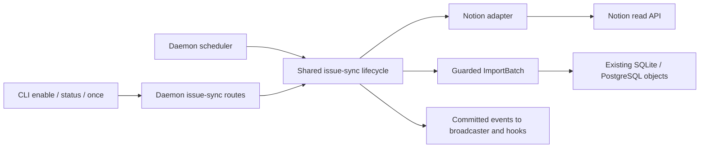

# Notion task sync

**Status: implemented v1.** The daemon-owned Notion adapter uses the shared
issue-sync lifecycle, existing persisted storage, and native import timestamp
rules. Commands and the shipped operating contract are documented in the
[Notion sync guide](../operations/notion-sync.md). No database schema change was
required. Completion write-back and the future assessment below remain deferred.

## Purpose and assumptions

Mirror one Notion task data source into one Kata project. A task created,
reassigned, edited, completed, or reopened in Notion becomes a native Kata issue
on the next successful sync, subject to the existing import timestamp rules.
An agent can work with those issues using normal Kata commands. Closing an
issue locally does **not** complete the Notion task in v1.

The requested behavior is the current [GitHub mirror](github-sync.md): Notion
owns upstream state; Kata polls from the daemon and stores native issues,
import mappings, events, and durable sync status. Polling is eventual, not an
atomic cross-system snapshot. The default interval is five minutes.

Operating assumptions:

- Operators can create a Notion internal connection with read-content access
  and share the task database with it. V1 uses one daemon-configured credential.
- Operators can identify which status options mean completed. Kata must not
  guess completion from English names, colors, group order, or a localized UI.
- A data source fits the bounded read limits below. Very large collections need
  a later partitioning or webhook design.
- Matching GitHub's one-way behavior matters more than covering every Notion
  feature. Comments, native due dates, relations, and write-back are deferred.

## Existing mechanisms and choice

| Approach | Benefit | Cost and decision |
| --- | --- | --- |
| Built-in Notion adapter over the existing issue-sync lifecycle | Reuses durable bindings, claim fences, import replay, scheduling, events, and status | **Implemented.** Extract only shared orchestration from `internal/githubsync`; keep provider fetch/mapping logic separate. |
| External-root connector plus collection enumeration | Credentials and per-root writes can live in a plugin; existing bridges support completion | Protocol v1 has no collection discovery/cursor method. Bulk enumeration and exclusive ownership would require an explicit extension. Defer. |
| Separate Notion runner copied from GitHub | Small initial conceptual change | Duplicates claim, drain, cleanup, progress, and cursor guarantees that have already needed fixes. Reject. |

The provider-neutral REST path is a lifecycle API, not a plugin runtime.
`pkg/connector/protocol.go` and `internal/connector/client.go` implement a real
executable protocol, documented in the [connector contract](../reference/connector-protocol.md).
It resolves and reads one root, reads comments/fields, and supports
`complete_root`, `publish_comment`, and field writes. It cannot list a task
collection. This implementation does not add protocol methods or change bridge
ownership rules.

### Architecture



`internal/issuesync` owns the shared claim/schedule/import/finalize
and in-memory progress machinery. A provider adapter prepares a complete
`db.ImportBatchParams` and an optional post-import finalizer. GitHub keeps its
repository refresh, parents scan, legacy-title handling, comment reads, and
parent-backfill finalizer in `internal/githubsync`. Its exported runner/progress
entry points remain wrappers or aliases, preserving GitHub callers and results. This is two built-in providers and a small
adapter interface, not a registration framework.

`internal/notionsync` owns canonical config, Notion reads, property resolution,
mapping, and safe error translation. Both the CLI-started daemon
(`cmd/kata/daemon_cmd.go`) and embedded service (`service.go`) install scheduled
Notion runs. HTTP/manual and scheduled runners share their daemon's progress
tracker and credential-aware HTTP client. Both entry points retain activity
admission, event forking, shutdown cancellation, and shared scheduled/manual
progress.

## Notion API evidence and boundaries

The following contracts were checked against official documentation on
2026-09-28. Pin `Notion-Version: 2026-03-11`; ignore unknown response fields.
API additions can apply even to pinned versions.
[Versioning](https://developers.notion.com/reference/versioning)

- A database is a container with child data sources. Retrieve the database to
  enumerate those identities; retrieve/query a **data source** for its schema
  and pages. Use IDs, not generated URL forms, as durable identities.
  [Database retrieval](https://developers.notion.com/reference/retrieve-database),
  [data sources](https://developers.notion.com/reference/data-source)
- The Notion UI lets an operator designate status, assignee, and due-date
  properties when turning a database into Tasks. Names are customizable.
  The reviewed public database/data-source schemas do not document the task
  designation or selected task-property roles. This is an API limitation
  inferred from those schemas, not a claim that the UI lacks those roles.
  Kata therefore resolves properties by type or explicit selection.
  [Task databases](https://www.notion.com/help/sprints),
  [data-source retrieval](https://developers.notion.com/reference/retrieve-a-data-source)
- Property and status-option IDs survive renames. Status schemas expose
  options and groups but no universal Kata completion mapping. People values
  can be partial and can include groups; display names and email addresses are
  unsuitable as identity. Property-item pagination supplies complete values
  when page summaries omit people or title references.
  [Property schema](https://developers.notion.com/reference/property-object),
  [property values](https://developers.notion.com/reference/page-property-values)
- Data-source queries support `last_edited_time` filters and sorts, opaque
  cursors, and a maximum page size of 100. A query is capped at 10,000 results;
  `request_status.type == "incomplete"` can appear on any response page even
  when `has_more` is false. Archive selection uses `is_archived`, which is
  distinct from `in_trash`; do not send `in_trash` as a query parameter.
  [Query API](https://developers.notion.com/reference/query-a-data-source),
  [timestamp filters](https://developers.notion.com/reference/filter-data-source-entries)
- `GET /v1/pages/{page_id}/markdown` returns enhanced markdown. Its `truncated`
  and `unknown_block_ids` can mean size limits or inaccessible subtrees;
  unsupported blocks may remain as unknown tags. This is useful page content,
  not a guaranteed lossless Markdown export.
  [Markdown retrieval](https://developers.notion.com/reference/retrieve-page-markdown)
- Current limits include 180 requests/minute for most plans and 600 for
  Business/Enterprise, plus shared workspace limits. Handle 429 and 529 with
  `Retry-After`; an access-restricted 429 is not retryable.
  [Request limits](https://developers.notion.com/reference/request-limits)
- A connection needs both capabilities and access to the relevant pages.
  Not-found can mean inaccessible. Listing comments returns unresolved page or
  block comments, not a complete historical comment stream. V1 requests no
  comment capability and does not infer comment changes from page timestamps.
  [Authorization](https://developers.notion.com/guides/get-started/authorization),
  [comments](https://developers.notion.com/reference/list-comments)

## Binding and operator contract

Shipped commands:

```sh
kata sync notion enable --data-source 11111111-1111-4111-8111-111111111111 \
  --status-property 'Workflow' --assignee-property 'Responsible' \
  --done-status 'Delivered' --interval 5m
kata sync notion status
kata sync notion once
kata sync notion disable
```

Initial enable requires exactly one of `--data-source <uuid>` and
`--database <uuid-or-url>`, plus at least one repeatable `--done-status`.
`--database` is a convenience: resolve its ID locally, then the daemon retrieves
its child sources. Select the only child; zero children or multiple children
fail with safe IDs/names and instructions to use `--data-source`. Do not guess
from a database view, linked view, search result, or similarly named database.

Accept database UUIDs with or without hyphens and canonicalize to lowercase
hyphenated UUIDs. Convenience URLs accept HTTPS `notion.so`, `www.notion.so`,
`notion.com`, `www.notion.com`, or `app.notion.com` with a UUID in the final path
segment (including `/p/<uuid>`); ignore query/fragment after parsing. Reject
userinfo, explicit non-default ports, custom domains, ambiguous paths, and
short task-ID links. Parse links only; never fetch their origin or follow their
redirects. Notion URL formats can change; explicit IDs remain the reliable path.

Store `provider="notion"`, `remote_id=<data_source_uuid>`, and
`source_key="notion:<data_source_uuid>"`. Page import IDs are
`page:<page_uuid>`. Database names, data-source names, titles, task ID properties,
and URLs are display data, never import identity. A blank data-source name uses
the display label `Notion data source <data_source_uuid>`; a later source rename
refreshes the binding label.

Canonical config contains only:

- `data_source_id`, `database_id` (current parent container), and `since`.
- `title_prefix` (boolean, initially true; legacy omission defaults to true).
- `title_property_id` (the unique title property), `status_property_id`,
  `assignee_property_id`, and sorted unique `done_status_ids`.

Resolve selectors as exact returned ID first, otherwise exact case-sensitive
name; a name colliding with a different property's ID is rejected. The title
property is the unique `title` type. If status or assignee is omitted, select
the sole property of type `status` or `people` respectively. Missing or multiple
candidates fail and list choices; no preferred English property names.
`--status-property` and `--assignee-property` override that discovery.
`--done-status` selects existing options of the chosen status property using
the same ID/name rule. Persist IDs only. Completion options are never inferred
from `Done`, `Complete`, color, or array position.

Mappings are immutable for a binding in v1: data source, property IDs, and the
set of completed option IDs cannot change on re-enable. Omitted selectors on
re-enable reuse stored selections; explicit identical selections are accepted.
Re-enable may omit the locator and done-status flags if a Notion binding exists.
Changing interval, setting/removing `--since`, or toggling `--title-prefix` is
supported. Omitted `--title-prefix` preserves the saved choice; explicit false
round-trips in config. Schema and parent-container refreshes preserve that
presentation choice. Since accepts
`YYYY-MM-DD` (midnight UTC) or RFC3339 with whole seconds, normalizes offsets to
UTC, and rejects fractional seconds, matching the GitHub CLI contract. Omitted `--since`
on re-enable preserves it; `--since ''` removes it. Canonical config changes
reset the cursor using existing storage behavior; interval-only changes do not.

A property or option rename keeps working by ID. On every run validate selected
property IDs/types and completed option IDs against current schema; deleting
or changing a selected property, or deleting a selected completed option,
fails without advancing the cursor. Newly added status options are open unless
their IDs are in the original completed set. Changing group membership does not
change that set. Changing the mapping of already imported rows needs deliberate
re-projection, because replaying an equal timestamp does not replace ordinary
scalar fields. A cursor reset alone cannot implement remapping; that feature
is deferred rather than silently producing stale projections.

All lifecycle routes reuse
`/api/v1/projects/{project_id}/issue-sync/notion/{enable,disable,status,once}`
with the existing methods and response envelopes. Enable input `config` keys
are `data_source_id` or `database`, `status_property`, `assignee_property`,
`done_statuses` (string array), `since` (string), and `title_prefix` (boolean).
Explicit null or a non-boolean title prefix is rejected. Locator/selector names are
input only; status returns resolved non-secret config, source identity,
historical counts, and optional live progress. Omitted interval defaults to
300 seconds initially and preserves the previous interval on re-enable. An
explicit interval must be at least one second; conflicting interval forms are
rejected. Track interval-seconds presence in request decoding: an explicitly
supplied zero is invalid, while omission defaults or preserves. These are Notion validation rules; GitHub keeps its current rules. Unknown Notion input/config keys, including
`token`, `token_env`, and `api_url`, are rejected. Existing GitHub validation
and response contracts stay intact.

Enable validates against the current binding and carries its expected ID/config
(or expected absence) into the existing storage transaction. An optional call
precondition on `UpsertIssueSyncBindingParams` is checked in both backends.
It includes the observed interval, so an omitted
interval cannot overwrite a concurrent interval change with a stale value.
A stale enable returns 409 without overwriting accepted mappings or scheduling. This is no
schema change. GitHub callers omit it and retain their current behavior.

One project still has at most one external issue source, including disabled
bindings. A GitHub binding cannot be replaced with Notion, nor can a Notion
binding be retargeted to a different source. Use another Kata project. `once`
requires an enabled binding. Disable preserves imports, mappings, cursor, and
history while fencing further writes. Enabled federation spokes are rejected;
a hub may import and replicate native Kata events to spokes.

## Credentials and access

Proposed daemon configuration:

```toml
[notion_sync]
token_env = "KATA_NOTION_TOKEN"
```

The sole setting is the name of a daemon environment variable, defaulting to
`KATA_NOTION_TOKEN`. There is no raw-token setting, CLI token flag, client-side
login fallback, persisted credential, or per-binding environment selection.
The embedding API exposes the same non-secret setting. Resolve the variable at
the start of each validation/run, retaining one credential for that session so
rotation takes effect on the next operation.

Send it only to fixed `https://api.notion.com:443` through the built-in client.
Reject redirects. A page, database, markdown, or error URL is never an outbound
request target. Use explicit ID-based API paths; validate returned parent and
object IDs. Never forward the Kata daemon bearer, browser credentials, or actor
headers. Standard certificate verification is required. Tests inject an HTTP
transport, not a production API-origin override.

Internal connections with read-content permission suffice. Share the source
container and any content that must be readable. Remote CLI clients rely on the
remote daemon's Notion credential. Enable validates schema and access before
storing a binding. A later 401/403/404 is an actionable safe run error, not a
request to close/delete imported tasks. Do not include tokens, response bodies,
request headers, or transport dumps in durable errors or logs.

## Issue projection and local edits

| Notion value | Kata projection |
| --- | --- |
| Page UUID | Stable `page:<uuid>` import mapping under the data source key |
| Title property's complete plain text | `[Notion] <title>` by default; `--title-prefix=false` retains the title and adds the `notion` label. Empty text becomes `(untitled)`, prefixed when enabled. |
| Enhanced markdown | Body followed by `\n---\nImported from Notion: <page-url>` |
| Selected completed status option ID | `status=closed`, `closed_reason=done` |
| Any other valid status option, or null status | `status=open`, no closed fields |
| First person in complete selected people property | Owner `notion:<user_uuid>`; empty means unassigned |
| Page creator | Author `notion:<user_uuid>`; missing creator uses `notion-unknown` |
| `created_time`, `last_edited_time` | Source timestamps, normalized to UTC millisecond precision |

Kata has `open` and `closed`, not a separate `in_progress` status. Notion's
in-progress tasks remain open. A later upstream non-completed status reopens a
locally closed issue only when its source timestamp is newer than the local
issue. A source completion timestamp is not supplied: use `last_edited_time`
for `closed_at`, explicitly an observation approximation rather than audit
proof of the actual completion time. Require valid ordered source timestamps;
do not invent the poll time as a source edit.

Use complete title and people property-item reads, with pagination. Skip groups
when selecting the first user; preserve API order among users. User names and
emails are not identities; no workspace user enumeration or email scope is
needed. Stable external owners do not automatically become local agent names.
An explicit account-to-actor map and co-assignee fan-out are future work.

Projection goes through `ImportBatch`, not ordinary close/edit commands, so it
preserves the existing import/event behavior. A source version newer than
`issue.updated_at` can replace title, body, status, owner, closed fields, and
priority. As with the current GitHub mapper, Notion supplies nil priority; a
newer import can therefore clear a local priority. Equal/older versions preserve
local scalar edits, except the import path's existing title presentation/time
repair rules. Repeated polls do not continually undo local closure until
Notion produces a newer source version. Local comments, metadata, dates,
labels, and relationships remain local. The adapter imports no arbitrary upstream
labels or links, but manages the plain `notion` presentation label when title
prefixing is disabled. GitHub uses the equivalent plain `github` label.
Presentation changes can update source-owned titles at the same source timestamp
and add/remove the presentation label at the latest observed source version,
including after local scalar edits. Other labels retain their normal ownership
and timestamp rules; existing local labels are never adopted by the source.
Older replays cannot refresh presentation labels, and the latest observed source
timestamp is retained so repeated older replays stay stale. Local updates never
go to Notion.

Due dates are explicitly deferred: `db.ImportItem` currently has no
`scheduled_on` or `deadline_on`. Existing columns alone do not make import,
event replay, clearing, date ranges, and timezone semantics work. A future
no-schema extension could add optional planning fields to ImportItem plus
both backend writes and event/replay tests, after choosing range semantics.
This v1 neither adds that extension nor substitutes the due date into metadata.

## Bounded reads and cursor semantics

Each run claims the binding with the existing UTC millisecond timestamp and
30-minute abandoned-claim horizon. Notion uses a 25-minute total run deadline,
leaving cleanup time before a claim can be stolen. A per-binding timeout is
a failed attempt: retain its cursor and continue other due bindings and future
polls. Only cancellation of the scheduler parent context stops its worker.
HTTP requests have a
30-second attempt timeout, clipped by the remaining run deadline.

1. Retrieve and validate the data source/schema and its current parent database.
   Refresh display/container metadata only with `StartedAt` claim fencing;
   preserve all selected IDs and `since`. Moving the data source's container
   does not retarget its identity if access remains available.
2. Query pages with `result_type=page`, `is_archived=false`, page size 100, and
   ascending `last_edited_time`. The lower bound is the later of the explicit
   exclusive `since` and `last_cursor_at - 2 minutes`. Use inclusive
   `on_or_after` for overlap; additionally filter strictly `> since` locally
   before property/body requests. No cursor means no lower bound except since.
3. Follow opaque `next_cursor` values until complete. Reject repeated cursors,
   missing next cursors when `has_more`, wrong object IDs or malformed parent identities,
   malformed timestamps, or any incomplete request status. Do not parse or
   persist the opaque pagination cursor. Coalesce duplicate page IDs at the
   newest source timestamp; equal versions with conflicting metadata fail.
4. Read complete title/people values and page markdown, then retrieve the page
   again. Require unchanged `last_edited_time`, selected scalar properties,
   parent, and availability markers across the read. Retry the page once on
   change, then fail the run rather than stamp mixed content with an old
   timestamp. This detects observed races; Notion offers no transaction across
   these calls, and indexing/descendant edit propagation is not guaranteed.
5. Prepare the complete bounded batch before writing issue rows. Import in the
   existing 5,000-item chunks with `IssueSyncImportGuard`. Deliver each chunk's
   committed events immediately through the existing broadcaster/hook sink.
6. After all chunks and finalization succeed, record success with cursor equal
   to run start, never fetch completion or the maximum returned timestamp.
   The next overlap catches edits made during the run. Empty successful runs
   also advance the cursor.

Limits are constants in v1: at most 10,000 unique pages and 1,000 query response
pages per run; 100 property response pages and 10,000 values per selected
property; 8 MiB decoded HTTP response body; 1 MiB UTF-8 markdown content per page;
64 MiB cumulative serialized import items before commit. Limit violations fail
with a safe bound-specific error and unchanged cursor. No automatic query
partitioner is included. Operators may choose a later `since` for a deliberately
narrower mirror, with old imports retained.

A markdown response with `truncated=true` or any `unknown_block_ids` fails this
run. V1 does not recursively expand arbitrary subtrees. An unsupported block
represented by an `<unknown .../>` tag with no truncation signal remains a
visible placeholder. Do not fetch attachments, embed URLs, or signed file URLs;
those links can expire. Do not silently truncate bodies or treat partial
content as a complete source revision.

Queue calls across bindings using the daemon's shared client at no more than
three requests/second for its credential. Retry read operations, including the
read-only query POST, for 429/529 and transient 500/502/503/504/network failures:
five total attempts, exponential delays 1/2/4/8 seconds plus up to 250 ms jitter,
and at least `Retry-After` when supplied. The shared queue honors the cooldown.
If waiting would exceed the run deadline, fail; never shorten Retry-After.
Do not retry invalid requests, authentication/permission errors, or
`public_api_request_blocked` under `additional_data.rate_limit_reason`. All waits are context-cancellable.

Fetching/mapping failures write no issue rows. An import/finalization failure
can leave earlier committed chunks visible; it does not advance the cursor.
Replay is idempotent by stable page identity. As in GitHub, event-sink failures
are logged after commit and do not turn a successful durable import into a
failed run; no exactly-once external hook guarantee is added. Superseded runs
cannot import, refresh config, clear a successor's claim, or record success.

The overlap is a best-effort polling recovery window, not a guarantee against
arbitrarily delayed Notion indexing or clock skew. The total-run bound and
since limitation are visible operating limits. A future unconditional backfill
or webhook reconciliation can address observations outside that window.

## Unavailable pages, progress, and persistence

No absence-based deletion or closure. Archived, trashed, moved-out, deleted,
or newly inaccessible pages can disappear from a query and remain in Kata.
Skip explicitly unavailable rows or a well-formed page whose parent now names
a different source/page during enumeration; if a
previously eligible row becomes unavailable during detail reads, fail the run
and retry from the unchanged cursor. After it disappears from enumeration, a
later run can succeed while retaining the last imported issue. Archive is not
task completion. `is_archived` and `in_trash` must be checked separately; a
legacy `archived` alias alone must not replace those checks. No all-page
membership scan or page-deletion propagation is promised.

Progress is in-memory and tied to `(binding_id, claim_started_at)`:
`source`, `pages`, `content`, `importing`, `finalizing`. Counts reset on phase
changes. Pages count accepted unique rows with unknown total (`0`); content
counts completed eligible pages; importing counts committed items after event
delivery. Status includes a copied snapshot only if it matches the durable
active claim. Both manual and scheduled paths, including the embedded service,
share the tracker. Rejected claims do not replace it and an old run cannot
update/remove a successor's entry. Last-success counts remain historical;
`last_comments=0` for Notion.

Reuse `issue_sync_bindings`, `issue_sync_status`, `import_mappings`, issues,
and events unchanged in SQLite and PostgreSQL. No migrations, schema versions,
DDL, or new persisted objects. Existing JSONL export/import carries canonical
non-secret config; normal restore keeps bindings disabled, so copied historical
`sync_started_at` values confer no active-run authority. Local re-enable clears
that copied timestamp and requires a fresh claim. Preserve the trusted cutover exception.

Existing external-root conflicts remain: a mirror-managed issue cannot receive
an active bridge binding even after polling is disabled, and a source with
active external-root ownership cannot be enabled for issue sync. Generic
imports also cannot overwrite active external-root title/body. Do not bypass
these checks to provide Notion completion or date mapping.

## Acceptance criteria and non-goals

V1 is ready when these observable contracts hold:

1. A custom-named Notion task source enables with explicit completion choices;
   ambiguous discovery and unknown inputs fail before durable enablement.
2. Completion, reopen, title/body, and owner changes appear after a successful
   sync according to source-newer rules; replay creates no duplicate issue or
   event, and local close causes no Notion request that mutates content.
3. Renames retain stable mappings; semantic remapping and source retargeting
   are rejected. Since changes reset the cursor without deleting old imports.
4. Paginated, rate-limited, partial, oversized, concurrently changed, and
   inaccessible responses obey the bounded failure and cursor rules.
5. Manual/scheduled races, disable/re-enable, stale claims, project archival,
   federation roles, external-root conflicts, and restore behave identically
   in both backends. Committed events reach browser/federation/hook paths.
6. Scheduled progress is visible through HTTP status in both daemon entry
   points; late updates cannot overwrite a successor. GitHub tests retain
   their existing parent/comment/presentation/progress behavior.
7. Credentials stay daemon-side and fixed-origin; redirect and error fixtures
   demonstrate no token leakage. Operator docs label this as one-way and
   explain the source, mapping, size, permission, and timestamp limits.

Non-goals: any Notion mutation; OAuth installation management; multiple Notion
credentials or multiple sources per project; view filters; arbitrary select or
checkbox lifecycle fields; priority/label mapping; comments; due dates;
relations/subtasks; deleted-page reconciliation; webhook hosting; a new plugin
protocol; public browser configuration controls.

## Future completion-only write-back

Completion is feasible and narrower than general bidirectional sync. Notion
can update a page's existing status option by ID with `PATCH /v1/pages/{id}`;
that needs update-content capability. Setting the same option is naturally
repeatable, but the public update endpoint supplies no documented conditional
revision precondition. Read-before-write/readback cannot eliminate a concurrent
human edit between those calls.
[Page updates](https://developers.notion.com/reference/patch-page)

Kata already has relevant machinery. `internal/rootbridge/reconciler.go` checks
local closure, current binding/claim authority and live completion enablement,
renews authority before `CompleteRoot`, and verifies a fresh `ReadRoot` result.
Its tests cover retries, reopening, binding changes, and disabled completion.
The protocol and conformance kit make a **per-root Notion connector** a plausible
separate feature. It could complete explicitly bridged tasks without first
inventing a general conflict engine.

Making *bulk-mirrored* tasks complete upstream is a different integration step.
Current imports and bridges deliberately exclude overlapping ownership.
Disabling the mirror does not remove that conflict. A follow-up must choose
one authority model: either discover tasks into bridge-owned roots with an
explicit collection protocol extension, or add opt-in completion commands to
issue sync using shared bridge principles. It must define when imported closes
must not trigger outbound echoes, what local reopen means, which completed
option to write, idempotent retries after ambiguous network failure, credential
capabilities, human-edit races, revocation, and durable retry observability.
Any new persisted outbox/state requires separate explicit schema consent.

The HTTP status write itself is small. A standalone connector is moderate
provider/conformance work using existing machinery; safely combining collection
mirroring and completion has greater lifecycle/ownership scope. Neither is
inherently impractical. Keep v1 one-way as requested and assess that follow-up
on these concrete boundaries, without promising
that local closure will already update Notion.
